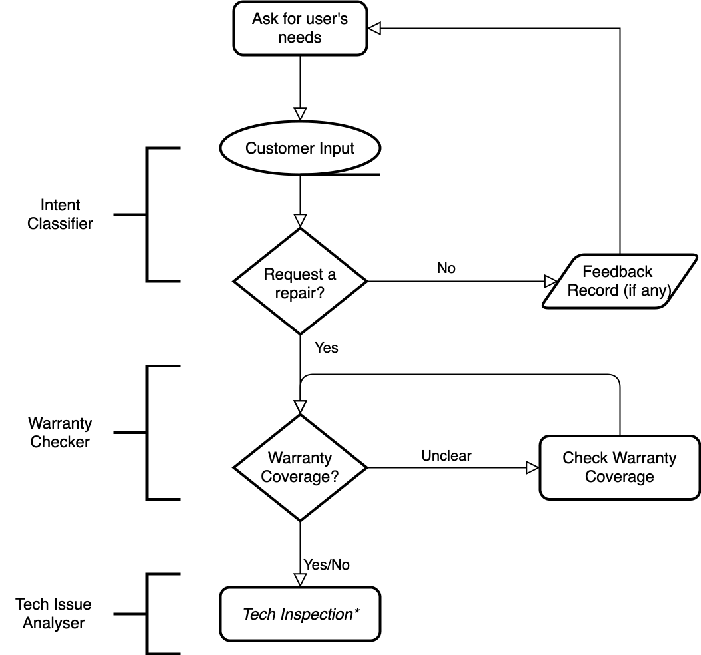
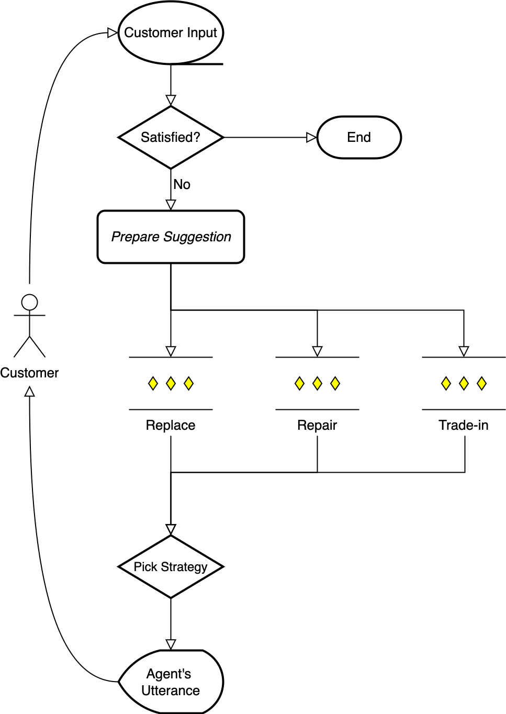
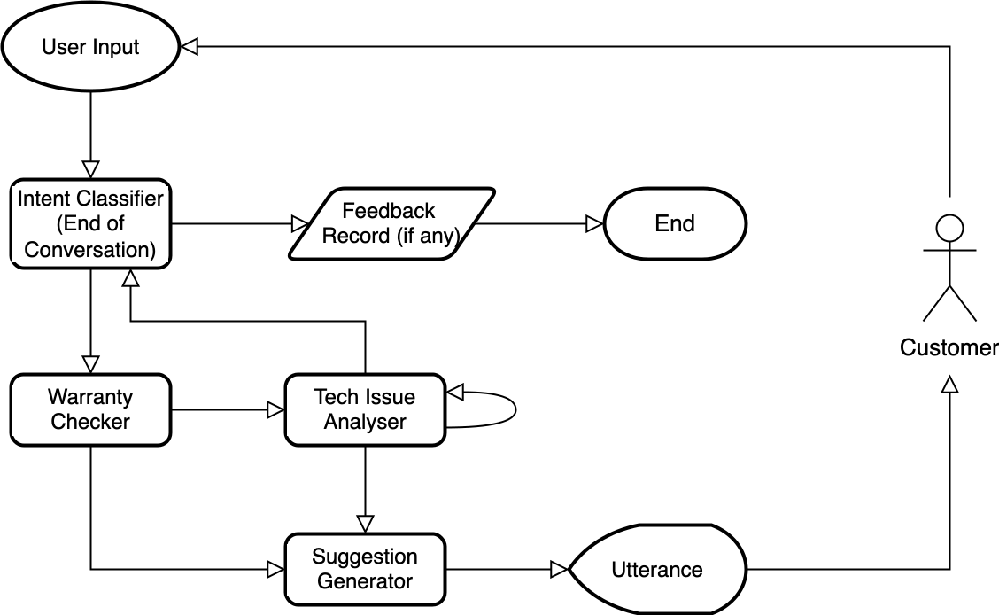

# XoT_Tutorial
A brief tutorial on Chain of Thoughts (CoT), Tree of Thoughts (CoT) and Graph of Thoughts (GoT) based on my own understandings.

## Scenario
Try to use a customer service scenario. The agent need to help the customer make a decision on whether to repair its device. This is not an easy task as the repairing fee could be high. If the repairing fee is close to buying a new one, trade-in the broken one and get a coupon might be a good choice.

To be specific, the agent need to figure out:
* Does the customer want to repair its device?
* If the customer do want to repair its device, give suggestions. It could be one of the following:
  * Repair the device, and pay the repairing fee.
  * Trade-in the device, and get a coupon for a brand new one.
* Note that the customer may purchased warrenty, which could significantly reduce the fee for a repair. That makes the decision making more complex.

### Settings of the Customer Tutorial

The conversation flow is like the follows:

|      Basic Information Collection      |      Tech-details Enquiry      |
| :----------------------: | :-----------------------: |
|  |  |

Firstly, the agent need to collect some basic information. Then it need to proceed to multiple rounds of interaction about enquiring tech details, etc.

We will try to use different prompting strategies in different steps.

## Direct use of LLMs

LLMs may directly handle the user intent part, i.e., it may distinguish whether the user is would like to comment on the current product or would like to request for "after-sales service".

May consider the following prompt:

> You are a customer service chatbot help to decide if the user want to repair its device. Base on the user's description, reply "Yes" if the user want to repair the device, "No" if the user do not want to repair the device, and "End" if the user want to end the conversation. 

## Chain of Thoughts (CoT)

Checking warranty coverage is more complex compared with checking intent. Basically, there are a few rules about warranty:
1. All products come with a 90-day warranty since purchase.
2. Customers can purchase additional warranty up to 2 years with an additional price. 

May consider the chain-of-though prompting, with background and fewshot examples:

#### Background: 
> You are a helpful agent that help to decide if a product is out of warranty. Note that all product come with a 90-day warranty since purchase. Customer can also purchase additional warranty that extends it to 2 years. Today is May 20th, 2024.

#### Warranty Checking Fewshot Examples

Fewshot examples:
> Question: When did you purchase this item?
> 
> Reply: A month ago.
> Analysis: Let's think step by step. All products come with a 90-day warranty. A month is within the 90-day time span. The product must have warranty.
> Warranty: Yes.
> Utterance: Great! Your product has warranty.

> Question: When did you purchase this item?
> 
> Reply: Last year.
> Analysis: Let's think step by step. All products come with a 90-day warranty. A year is more than this time span. However, we are not sure if the user purchased additional warranty. We are not sure if the product has warranty.
> Warranty: Unsure.
> Utterance: Did you purchase additional warranty?

## Tree of Thoughts (ToT)

<!-- Multi-rounds of interaction. As user may also complain about the product at the same time when trying to get customer service, it would be great to collect user feedback at the same time. -->

We first need the user to describe the concrete problem of the tablet. Then we need to find out the best suggestion for the user:
1. Repair. The price for repairing each part of the tablet is:
   1. Screen: 120 USD.
   2. Charging port: 50 USD.
   3. Battery: 30 USD.
   4. Keyboard: 20 USD.
   5. Others: 60 USD.
2. Replace. If the tablet is within its warrenty, we can replace the tablet with a new one (the same model) free of charge.
3. Trade-in. Give the user a 100 USD coupon that can be used for the newest model of the tablet. The newest model come with adidtional features and priced at 249 USD.

Suggestion Criterion:
1. Always tell the customer how much it takes to repair the tablet.
2. If the price difference between repair and trade-in is less than 20 USD, suggest the user to trade-in the broken tablet and buy a new one.

## Graph of Thoughts (GoT)

Allow jumping steps and collect information from the beginning. Using following graph architecture:

